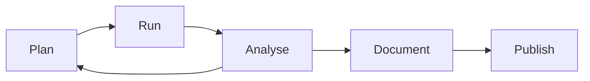

# Automated Research Workflow

The automated research pipeline executes the following feedback loop:

1. **Plan** – `ExperimentPlanner` proposes experiment plans based on performance gaps and similar historical results retrieved from the knowledge graph.
2. **Run** – `ExperimentRunner` executes experiments asynchronously via evaluator callbacks while emitting `genesis_experiments_total{status="completed"}` counters.
3. **Analyse** – `Reasoner` validates causal hypotheses and `Theorist` aggregates metrics to discover durable insights.
4. **Document** – `ReportSummarizer` and `PublicationArtifact` convert structured results into Markdown artefacts with provenance context.
5. **Publish** – `ExperimentReporter.publish()` pushes structured payloads that downstream services can export to dashboards or archives.

The CLI mirrors the workflow via `genesis plan`, `genesis run`, `genesis insight`, and `genesis report` commands. API routes under `/cognition` provide programmatic access to the same lifecycle, enabling governance to coordinate research clusters across the distributed system.
