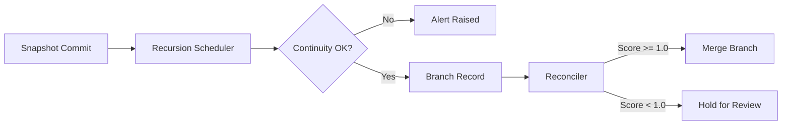

# Branching and Reconciliation

Temporal branching allows Genesis to explore alternate futures while preserving provenance for every fork. Branches are lightweight records that reference a parent commit, track divergence scores, and capture projected states for potential merge.

## Lifecycle

1. A snapshot is captured by the timeline manager.
2. The recursion scheduler simulates forward to produce a predicted state.
3. Continuity checks verify entropy and ethical bounds.
4. Passing predictions become branch records with divergence scores.
5. Reconciliation compares predicted and actual metrics prior to merge.
6. Successful merges increment `genesis_branch_merges_total` and may materialize new timeline commits.

## Governance Controls

Branch merges automatically fail when continuity violations are detected. The enforcer injects Prime Ethic principles into any violation list, ensuring operators see explicit reasons for blocked merges. Observability hooks expose branch lifecycles via the `/temporal/branch/list` API and the CLI `genesis merge` command.

The combination of deterministic branching and strict reconciliation keeps causal provenance intact even as Genesis experiments with alternate futures.
