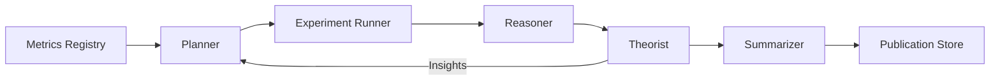

# Genesis Cognition Architecture

Genesis Phase 5 introduces a cognition stack that autonomously proposes, executes, and analyses research experiments. The stack is composed of four cooperating services:

- **Planner** – synthesises experiment plans from performance gaps and prior knowledge.
- **Reasoner** – compares module outcomes and produces causal statements that explain observed differences.
- **Theorist** – aggregates experiment history into durable trends and rules.
- **Summarizer** – converts results into self-contained artefacts ready for publication.

Every cognition component emits Prometheus metrics such as `genesis_reasoner_latency_seconds` and `genesis_experiments_total`, enabling observability across autonomous research cycles.
