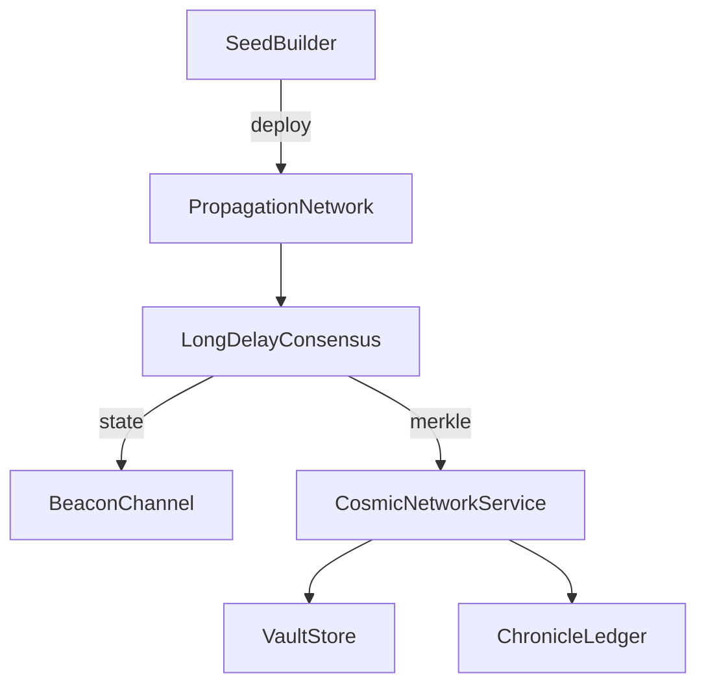

# Cosmic Architecture

The Phase 8 expansion promotes Genesis from a planetary mesh into an interstellar
coordination fabric. The new `genesis.cosmic` package combines seed packaging,
replication, relativity-aware consensus, and telemetry so detached civilizations
can remain interoperable.

* **Seeds** encapsulate the minimal kernel, ethics, and knowledge required to
  bootstrap a federation in a new sector.
* **Propagation** uses CRDT records to buffer updates across years-long gaps.
* **Consensus** merges detached branches while providing Merkle fingerprints for
  integrity proofs.
* **Beacons** offer low-bandwidth, tamper-evident telemetry to advertise
  presence without revealing sensitive payloads.

The FastAPI router at `src/genesis/api/routes/cosmic.py` and the Typer commands
(`genesis seed`, `genesis cosmic`, `genesis vault`, `genesis chronicle`) expose
these capabilities for automation pipelines and human operators alike.
