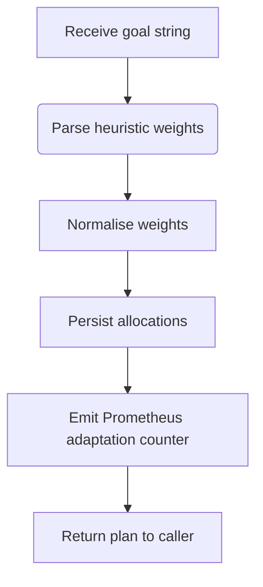

# Global Adaptation Engine

The global adaptation engine rebalances workload placement across federations
using a weighted cost model.  It simulates annealing-like behaviour by
re-evaluating priorities for energy, latency, and risk before emitting a
normalised allocation vector.

## Optimisation Loop

### Goals and Weights

The engine recognises textual goals and adjusts weights accordingly:

| Goal Snippet    | Energy Weight | Latency Weight | Risk Weight |
|-----------------|---------------|----------------|-------------|
| `reduce latency`| 1.0           | 2.0            | 1.0         |
| `balance`       | 1.5           | 1.5            | 1.0         |
| `energy`        | 2.5           | 1.0            | 1.0         |
| `risk`          | 1.0           | 1.0            | 2.5         |

Weights are normalised to sum to 1.0 in the resulting allocation map.

### Energy Balancing Heuristic

Energy balancing prefers federations with lower marginal energy cost, modelled
as the `energy` component of the allocation vector.  Operators can feed measured
MWh values to the global intelligence module, which updates the
`genesis_global_energy_mwh` gauge.  Adaptation plans should be scheduled so that
federations with surplus renewable energy receive a larger share of workloads.

### Peace Index Integration

After each treaty ratification the diplomatic runtime calls
`GlobalIntelligence.update_peace_index`, ensuring the adaptation engine has
visibility into system stability.  When the peace index drops, operators can run
`genesis adapt --goal "balance"` to push more workload toward reliable regions
while the court resolves disputes.
