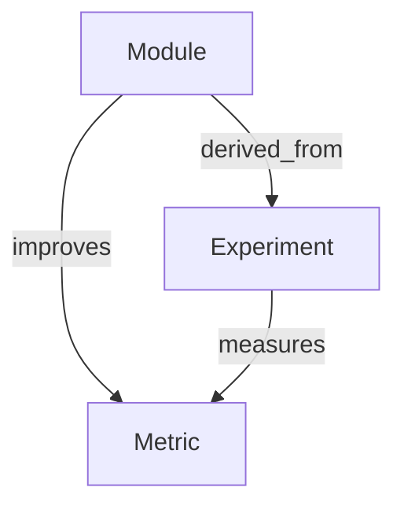

# Knowledge Graph Overview

The cognition layer maintains an in-memory knowledge graph that captures relationships between modules, metrics, experiments, and governance policies. Nodes are typed via the `KnowledgeNodeType` enumeration, while directed edges use `KnowledgeRelation` values to express improvement or derivation relationships.

`KnowledgeGraph` exposes helper methods for adding nodes and edges, querying neighbours, and generating summary counts. The companion `EmbeddingStore` keeps cosine-normalised vectors which power semantic retrieval through the `KnowledgeRetriever` utility.

Each insertion updates the `genesis_knowledge_nodes_total` gauge so dashboards can visualise the growth of collective knowledge over time.
