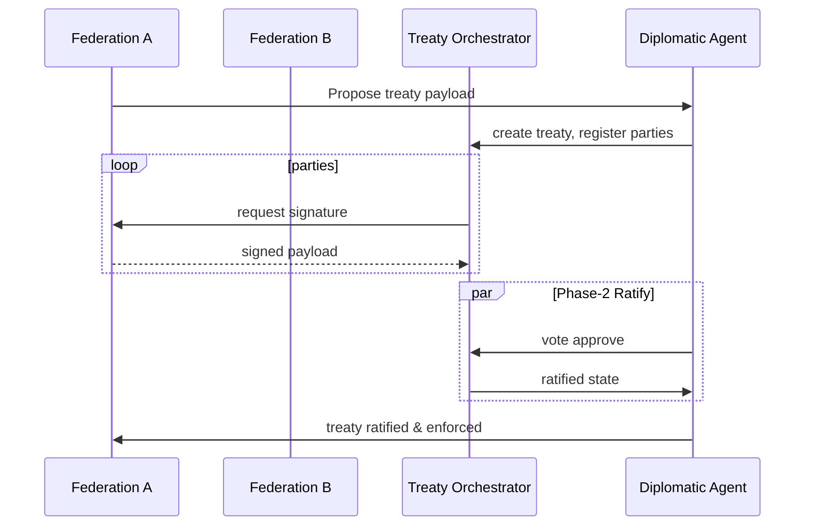

# Genesis Planetary Meta-Network Architecture

The planetary meta-network links autonomous Genesis federations into a secure
mesh.  Each node retains local sovereignty while delegating coordination to a
lightweight overlay built from asynchronous Python stand-ins for the production
Rust/WebRTC components.

## Layered Components

```
+-------------------------------------------------------------+
| Diplomacy Agent                                             |
|  - treaty orchestration  - dispute resolution  - adaptation |
+---------------------+--------------------+------------------+
| Treaties            | Exchanges          | Interconnect     |
| Three-phase commit  | Atomic credit swaps| Secure overlay   |
+---------------------+--------------------+------------------+
| Federation registry | Metrics            | Law + Sanctions  |
+-------------------------------------------------------------+
```

* **Interconnect** – maintains deterministic WebRTC-like links between
  federations, measuring latency and tracking link health.
* **Treaty** – provides 3-phase commit treaty lifecycle with cryptographic
  signatures and Prometheus instrumentation.
* **Exchange** – executes atomic swaps using a Merkle ledger to ensure
  double-spend protection.
* **Diplomacy** – orchestrates high-level workflows (treaties, exchanges,
  sanctions, adaptation) while calling into global intelligence and law.

## Treaty Negotiation Flow



## Observability

Prometheus metrics exported by this layer:

- `genesis_metanet_federations_total` – current registered federations.
- `genesis_treaties_active_total` – treaties not rejected.
- `genesis_exchanges_total` – atomic swaps committed.
- `genesis_latency_mean_ms` – mean active link latency.
- `genesis_peace_index` – composite stability index.

Grafana dashboards use these metrics to build federation maps, treaty activity
heatmaps, and peace index trend overlays.
