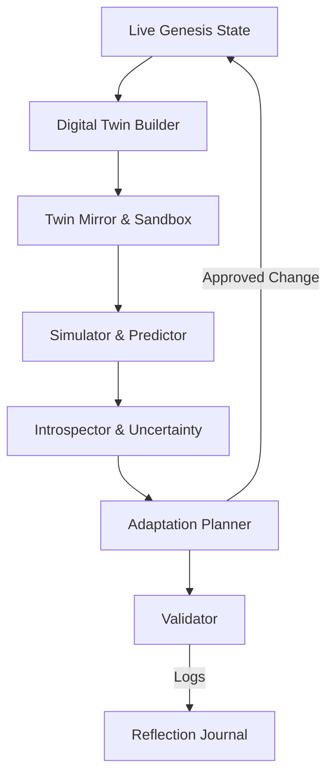

# Reflexive Architecture

Phase 9 extends Genesis with a reflexive intelligence stack that maintains a living digital twin, evaluates simulated changes, and reasons about its own confidence. The layer is organised into three intertwined subsystems:

1. **Reflexion** — builds the digital twin, mirrors live state into isolated sandboxes, and executes deterministic simulations.
2. **Meta-cognition** — tracks uncertainty, inspects model drift, and records reflection journals for every adaptation.
3. **Adaptation** — plans controlled experiments, validates them against ethics and safety constraints, and approves production rollout.

The digital twin forms a continuously updated "shadow" of the entire runtime, including module topology, observability metrics, and configuration parameters. Each iteration flows through simulation, meta-cognitive introspection, and adaptation planning, ensuring that no change reaches production without causal explanations and confidence estimates.
