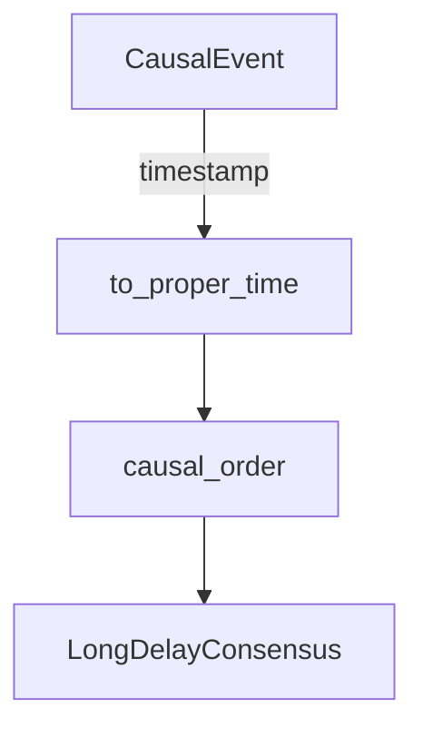

# Relativity and Causality

Communication between autonomous Seeds experiences extreme delays and relativistic
skews. The `genesis.cosmic.relativity` module provides Lorentz-aware helpers for
ordering events and translating between reference frames.

* `time_dilation_factor(v)` returns the Lorentz gamma for a velocity fraction of
  the speed of light, ensuring that proper times never exceed physical limits.
* `to_proper_time` converts asynchronous timestamps to frame-relative seconds so
  CRDT merges stay causally consistent.
* `causal_order` sorts interstellar events by proper time then UTC fallback,
  yielding deterministic histories even for disconnected branches.

These helpers feed directly into consensus reconciliation, Prometheus latency
histograms (`genesis_cosmic_latency_seconds`), and Grafana causal-delay charts.
