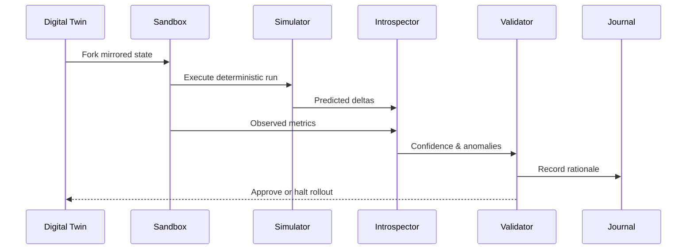

# Sandbox and Validation Loop

Every adaptation proposal is exercised in an isolated sandbox prior to rollout. The loop is orchestrated by `AdaptationPlanner`, `AdaptationSandbox`, and `ChangeValidator`:

The planner records every decision in the reflection journal, including the change rationale, predicted deltas, final validation outcome, and associated confidence. CLI and API surfaces expose these artifacts so internal agents can understand causality and reproduce experiments before committing to production changes.
